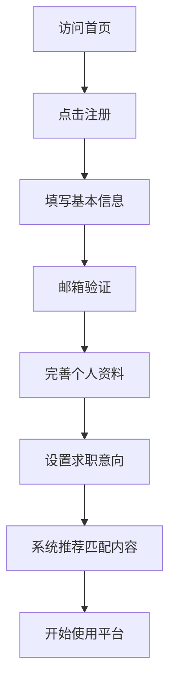
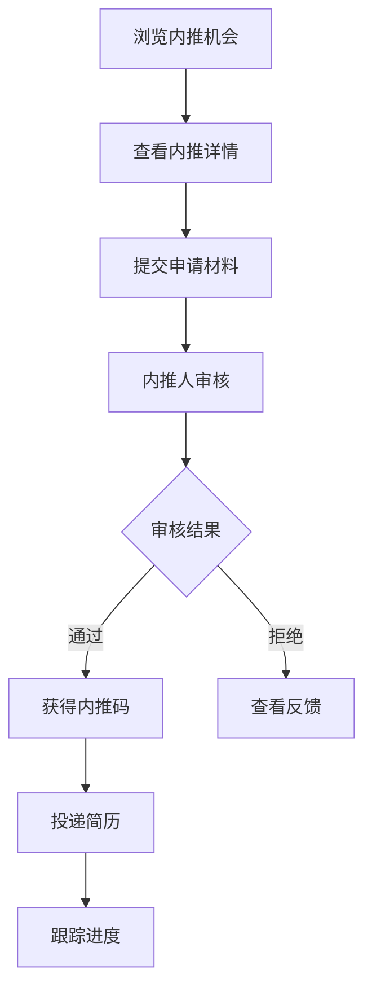
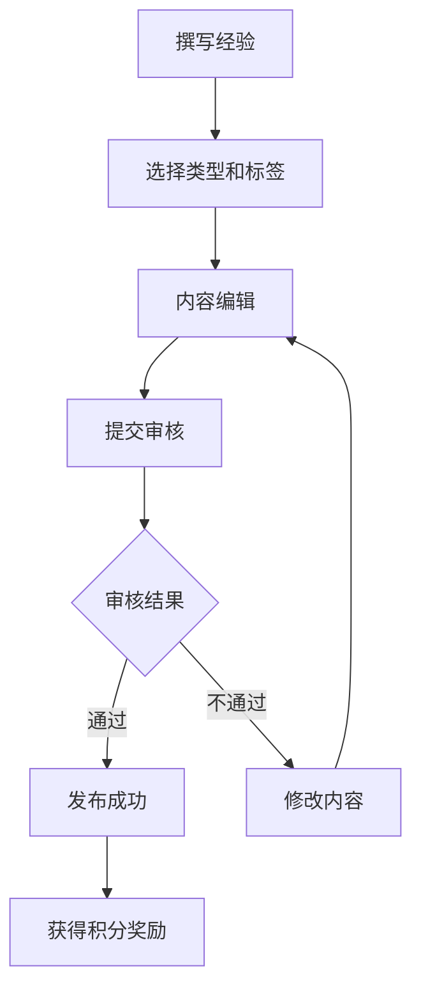

# 秋招应届生辅导平台 - 系统设计文档

## 📋 项目概述

### 项目定位
一个专门为应届生和在校生提供秋招求职辅导的综合性平台，集职位信息、内推机会、经验分享、薪酬透明化于一体，帮助学生顺利完成从校园到职场的过渡。

### 目标用户
- **主要用户**：应届毕业生、在校大学生（大三、大四、研二、研三）
- **内容贡献者**：已入职的往届毕业生、HR、职业导师
- **企业用户**：校招企业HR、招聘负责人

### 核心价值
1. **信息聚合**：整合分散的校招信息，提供一站式服务
2. **真实可靠**：通过用户验证机制确保信息真实性
3. **精准匹配**：基于用户背景智能推荐合适机会
4. **经验传承**：搭建学长学姐与学弟学妹的桥梁

---

## 🏗️ 系统架构

### 技术栈
基于现有 Open MCP 项目架构进行改造：

```
前端技术栈:
├── Next.js 15.3.1 (App Router)
├── TypeScript 5.7.3
├── Tailwind CSS + shadcn/ui
├── Zustand (状态管理)
├── React Query + tRPC (数据获取)
├── React Hook Form + Zod (表单验证)
└── Framer Motion (动画)

后端技术栈:
├── Next.js API Routes
├── tRPC (类型安全的API)
├── PostgreSQL (数据库)
├── Drizzle ORM (数据库ORM)
├── Better Auth (认证系统)
├── Inngest (后台任务)
└── Ali OSS (文件存储)

开发工具:
├── Turbo (Monorepo管理)
├── pnpm (包管理)
├── ESLint + Prettier (代码规范)
└── TypeScript (类型检查)
```

### 项目结构

```
open-mcp/
├── apps/
│   ├── web/                    # 主Web应用
│   │   ├── src/
│   │   │   ├── app/            # Next.js App Router
│   │   │   │   ├── (web)/      # 公开页面
│   │   │   │   │   ├── jobs/   # 职位模块
│   │   │   │   │   ├── referral/ # 内推模块
│   │   │   │   │   ├── experience/ # 经验模块
│   │   │   │   │   ├── salary/ # 薪酬模块
│   │   │   │   │   └── company/ # 公司模块
│   │   │   │   ├── (protected)/ # 需要登录的页面
│   │   │   │   │   ├── profile/ # 用户中心
│   │   │   │   │   ├── resume/ # 简历管理
│   │   │   │   │   └── settings/ # 设置
│   │   │   │   └── api/        # API路由
│   │   │   ├── components/     # React组件
│   │   │   ├── hooks/          # 自定义Hooks
│   │   │   └── lib/            # 工具函数
│   │   └── public/             # 静态资源
│   └── docs/                   # 文档站点
├── packages/
│   ├── ui/                     # 共享UI组件库
│   ├── db/                     # 数据库Schema和类型
│   ├── trpc/                   # tRPC路由和客户端
│   └── email/                  # 邮件模板
└── configs/                    # 配置文件
```

---

## 🎨 功能模块设计

### 1. 职位信息模块 📋

#### 功能列表
- **职位列表页**
  - 分页展示校招职位
  - 多维度筛选（城市、行业、公司规模、薪资范围）
  - 排序功能（最新发布、薪资最高、截止日期）
  - 职位卡片预览（公司logo、职位名称、薪资、地点）

- **职位详情页**
  - 公司介绍（规模、行业、融资情况）
  - 岗位职责和要求
  - 薪资福利详情
  - 申请流程说明
  - 相关面经推荐
  - 一键收藏/分享

- **职位搜索**
  - 全文搜索
  - 智能推荐
  - 搜索历史
  - 热门搜索词

#### 数据模型
```typescript
interface Job {
  id: string
  companyId: string
  title: string
  department: string
  jobType: 'fulltime' | 'intern' | 'parttime'
  educationRequirement: 'bachelor' | 'master' | 'phd' | 'any'
  experienceRequirement: string
  salaryMin: number
  salaryMax: number
  location: string[]
  description: string
  requirements: string[]
  benefits: string[]
  applicationDeadline: Date
  status: 'active' | 'closed' | 'draft'
  viewCount: number
  applicationCount: number
  createdAt: Date
  updatedAt: Date
}
```

### 2. 内推机会模块 🤝

#### 功能列表
- **内推列表**
  - 展示所有可用内推机会
  - 内推人信息展示（职位、工作年限、学校背景）
  - 内推成功率统计
  - 内推时效性标记

- **内推申请流程**
  1. 查看内推详情
  2. 提交申请（简历+自我介绍）
  3. 内推人审核
  4. 获取内推码/推荐
  5. 进度跟踪

- **内推人认证**
  - 企业邮箱验证
  - 工牌/在职证明上传
  - 信用评分系统

#### 数据模型
```typescript
interface Referral {
  id: string
  referrerId: string
  companyId: string
  jobId: string
  title: string
  description: string
  requirements: string[]
  quotaTotal: number
  quotaUsed: number
  validUntil: Date
  successRate: number
  status: 'active' | 'closed' | 'paused'
  createdAt: Date
}

interface ReferralApplication {
  id: string
  referralId: string
  applicantId: string
  resume: string
  introduction: string
  status: 'pending' | 'approved' | 'rejected' | 'referred'
  referralCode?: string
  feedback?: string
  createdAt: Date
  updatedAt: Date
}
```

### 3. 经验分享模块 📚

#### 功能列表
- **面经专区**
  - 按公司/岗位分类
  - 面试轮次标记（笔试、技术面、HR面）
  - 难度评分
  - 面试题目详解

- **求职攻略**
  - 简历撰写指南
  - 面试技巧分享
  - 薪资谈判策略
  - 入职准备清单

- **互动功能**
  - 点赞/收藏/评论
  - 打赏作者
  - 问答互动
  - 经验值系统

#### 数据模型
```typescript
interface Experience {
  id: string
  authorId: string
  type: 'interview' | 'guide' | 'review'
  companyId?: string
  jobTitle?: string
  title: string
  content: string // Markdown格式
  tags: string[]
  difficulty: 1 | 2 | 3 | 4 | 5
  helpful: number
  viewCount: number
  status: 'draft' | 'published' | 'archived'
  createdAt: Date
  updatedAt: Date
}
```

### 4. 薪酬曝光模块 💰

#### 功能列表
- **薪资统计**
  - 按公司/岗位/城市/学历维度统计
  - 薪资分布图表
  - 年终奖/股票期权统计
  - 薪资增长趋势

- **匿名爆料**
  - Offer详情分享
  - 薪资构成说明
  - 谈薪经验分享
  - 真实性验证机制

- **薪资工具**
  - 税后收入计算器
  - 五险一金计算器
  - 跳槽薪资评估
  - Offer对比工具

#### 数据模型
```typescript
interface Salary {
  id: string
  userId: string
  companyId: string
  jobTitle: string
  level: string
  location: string
  education: string
  yearsOfExperience: number
  baseSalary: number
  bonus: number
  stockOption?: number
  otherBenefits?: string
  totalCompensation: number
  isVerified: boolean
  verificationMethod?: string
  year: number
  anonymous: boolean
  createdAt: Date
}
```

### 5. 用户系统 👤

#### 功能列表
- **用户注册/登录**
  - 邮箱/手机号注册
  - 第三方登录（微信/GitHub）
  - 学生身份验证

- **个人中心**
  - 个人资料管理
  - 简历管理（创建/编辑/下载）
  - 求职意向设置
  - 投递记录
  - 收藏夹
  - 消息中心

- **积分系统**
  - 分享经验获得积分
  - 成功内推获得积分
  - 积分兑换权益

#### 数据模型
```typescript
interface User {
  id: string
  email: string
  phone?: string
  username: string
  avatar?: string
  realName?: string
  university?: string
  major?: string
  graduationYear?: number
  educationLevel: 'bachelor' | 'master' | 'phd'
  targetJobType?: string[]
  targetLocation?: string[]
  expectedSalary?: number
  isVerified: boolean
  isReferrer: boolean
  points: number
  role: 'student' | 'alumni' | 'hr' | 'admin'
  createdAt: Date
  updatedAt: Date
}

interface Resume {
  id: string
  userId: string
  title: string
  content: object // JSON格式的简历数据
  template: string
  isPublic: boolean
  viewCount: number
  downloadCount: number
  createdAt: Date
  updatedAt: Date
}
```

---

## 🔄 核心业务流程

### 1. 新用户注册流程


### 2. 内推申请流程


### 3. 经验分享流程


---

## 📊 页面路由设计

### 公开页面路由
```
/                          # 首页
├── /jobs                  # 职位列表
│   ├── /jobs/[id]        # 职位详情
│   └── /jobs/search      # 职位搜索
├── /referral             # 内推列表
│   └── /referral/[id]    # 内推详情
├── /experience           # 经验分享
│   ├── /experience/interview     # 面经专区
│   ├── /experience/guide        # 求职攻略
│   └── /experience/[id]        # 经验详情
├── /salary               # 薪酬数据
│   ├── /salary/statistics      # 薪资统计
│   ├── /salary/calculator     # 薪资计算器
│   └── /salary/compare       # Offer对比
├── /company              # 公司列表
│   └── /company/[id]     # 公司详情
├── /about                # 关于我们
├── /help                 # 帮助中心
└── /auth                 # 认证页面
    ├── /auth/login       # 登录
    ├── /auth/register    # 注册
    └── /auth/forgot      # 忘记密码
```

### 需要认证的页面路由
```
/profile                   # 个人中心
├── /profile/info         # 个人信息
├── /profile/resume       # 简历管理
│   ├── /profile/resume/create  # 创建简历
│   └── /profile/resume/[id]   # 编辑简历
├── /profile/applications # 投递记录
├── /profile/collections  # 我的收藏
├── /profile/referrals    # 我的内推
├── /profile/experiences  # 我的分享
├── /profile/messages     # 消息中心
└── /profile/settings     # 账号设置

/referrer                  # 内推人中心
├── /referrer/verify      # 身份认证
├── /referrer/post        # 发布内推
├── /referrer/manage      # 管理内推
└── /referrer/applications # 申请管理

/admin                     # 管理后台
├── /admin/users          # 用户管理
├── /admin/content        # 内容审核
├── /admin/companies      # 企业管理
└── /admin/analytics      # 数据分析
```

---

## 🎯 特色功能设计

### 1. AI智能助手
- **简历优化**：根据目标岗位JD优化简历内容
- **模拟面试**：AI面试官进行面试模拟和反馈
- **职位推荐**：基于用户画像的智能职位推荐
- **问答助手**：求职相关问题的智能解答

### 2. 校友圈功能
- **校友认证**：通过学校邮箱或学生证认证
- **校友网络**：查找同校/同专业的学长学姐
- **校友内推**：优先展示校友的内推机会
- **校友活动**：线上/线下的校友交流活动

### 3. 企业画像系统
- **公司文化**：员工真实评价
- **工作强度**：加班情况统计
- **晋升机会**：职业发展路径
- **团队氛围**：部门评价

### 4. 求职进度管理
- **时间线视图**：可视化求职进度
- **面试日程**：面试安排和提醒
- **状态跟踪**：简历投递到offer的全流程跟踪
- **数据统计**：投递成功率、面试通过率分析

---

## 🔐 安全与隐私

### 数据安全
- **加密存储**：敏感信息加密存储
- **HTTPS传输**：全站HTTPS加密传输
- **定期备份**：数据定期备份和灾备
- **访问控制**：基于角色的访问控制

### 隐私保护
- **匿名机制**：薪资爆料支持匿名
- **信息脱敏**：展示信息适当脱敏
- **隐私设置**：用户可控的隐私设置
- **数据删除**：支持账号注销和数据删除

### 内容审核
- **自动审核**：敏感词过滤和内容检测
- **人工审核**：重要内容人工复核
- **举报机制**：用户举报和处理流程
- **信用体系**：用户信用评分系统

---

## 📈 运营策略

### 用户增长
1. **校园大使计划**：在各高校招募校园大使
2. **内容营销**：高质量求职内容吸引用户
3. **社交裂变**：分享即可解锁更多功能
4. **合作推广**：与高校就业中心合作

### 内容建设
1. **UGC激励**：积分和等级体系激励用户贡献
2. **PGC合作**：邀请职业导师入驻
3. **企业合作**：官方认证的企业账号
4. **内容质量**：严格的内容审核机制

### 商业模式
1. **基础功能免费**：吸引用户使用
2. **增值服务**：简历诊断、模拟面试等付费服务
3. **企业服务**：为企业提供校招解决方案
4. **广告收入**：精准的招聘广告投放

---

## 🚀 实施计划

### Phase 1: MVP版本（1-2个月）
- [x] 项目初始化和技术栈搭建
- [ ] 用户系统（注册/登录/个人中心）
- [ ] 职位信息模块（列表/详情/搜索）
- [ ] 基础UI组件开发
- [ ] 数据库设计和初始化

### Phase 2: 核心功能（2-3个月）
- [ ] 内推机会模块
- [ ] 经验分享模块
- [ ] 薪酬曝光模块
- [ ] 简历管理功能
- [ ] 消息通知系统

### Phase 3: 增强功能（2-3个月）
- [ ] AI智能助手集成
- [ ] 校友圈功能
- [ ] 企业画像系统
- [ ] 数据分析后台
- [ ] 移动端适配优化

### Phase 4: 运营优化（持续）
- [ ] 性能优化
- [ ] SEO优化
- [ ] 用户体验优化
- [ ] 运营工具开发
- [ ] 数据报表系统

---

## 📝 技术规范

### 代码规范
- **TypeScript**：严格类型检查，避免any类型
- **组件设计**：遵循单一职责原则
- **命名规范**：统一的命名约定
- **注释规范**：关键逻辑必须注释

### Git规范
- **分支管理**：Git Flow工作流
- **提交规范**：Conventional Commits
- **代码审查**：PR必须经过Code Review
- **版本管理**：语义化版本控制

### 测试规范
- **单元测试**：核心功能单元测试覆盖
- **集成测试**：API接口测试
- **E2E测试**：关键流程端到端测试
- **性能测试**：定期性能测试和优化

### 部署规范
- **环境管理**：开发/测试/生产环境隔离
- **CI/CD**：自动化构建和部署
- **监控告警**：完善的监控和告警机制
- **日志管理**：统一的日志收集和分析

---

## 📚 参考资源

### 设计参考
- [Behance - Job Portal Designs](https://www.behance.net/search/projects/?search=job%20portal)
- [Dribbble - Career Platform](https://dribbble.com/search/career-platform)

### 技术文档
- [Next.js Documentation](https://nextjs.org/docs)
- [shadcn/ui Components](https://ui.shadcn.com)
- [tRPC Documentation](https://trpc.io/docs)
- [Drizzle ORM](https://orm.drizzle.team)

### 竞品分析
- 牛客网
- 应届生求职网
- 看准网
- 脉脉

---

## 🤝 团队协作

### 开发团队
- **前端开发**：2-3人
- **后端开发**：2人
- **UI/UX设计**：1人
- **产品经理**：1人
- **测试工程师**：1人

### 沟通机制
- **每日站会**：同步进度和问题
- **周例会**：需求评审和计划
- **代码评审**：保证代码质量
- **文档维护**：及时更新文档

---

## 📅 里程碑

| 时间节点 | 里程碑 | 关键指标 |
|---------|--------|---------|
| Month 1 | MVP上线 | 基础功能可用 |
| Month 3 | 核心功能完成 | 1000+注册用户 |
| Month 6 | 全功能上线 | 10000+注册用户 |
| Month 9 | 商业化探索 | 实现收支平衡 |
| Month 12 | 规模化运营 | 50000+活跃用户 |

---

## 🎯 成功指标

### 用户指标
- **注册用户数**：首年目标50000+
- **日活跃用户**：DAU 5000+
- **用户留存率**：次月留存40%+

### 内容指标
- **职位信息数**：10000+
- **面经分享数**：5000+
- **内推机会数**：1000+

### 业务指标
- **成功就业数**：1000+
- **用户满意度**：NPS 50+
- **平台收入**：实现盈亏平衡

---

## 📋 风险管理

### 技术风险
- **性能瓶颈**：提前做好性能优化和扩展性设计
- **安全漏洞**：定期安全审计和渗透测试
- **技术债务**：定期重构和代码优化

### 运营风险
- **内容质量**：建立严格的内容审核机制
- **用户流失**：持续优化用户体验
- **竞争压力**：差异化定位和创新

### 法律风险
- **隐私保护**：遵守相关法律法规
- **版权问题**：注意内容版权保护
- **劳动纠纷**：避免涉及劳动争议

---

## 🔄 持续改进

### 用户反馈
- **反馈渠道**：应用内反馈、客服系统、社群
- **定期调研**：用户满意度调查
- **快速响应**：及时处理用户问题

### 数据驱动
- **数据分析**：用户行为分析
- **A/B测试**：功能优化验证
- **指标监控**：关键指标实时监控

### 技术迭代
- **技术升级**：跟进新技术发展
- **架构优化**：持续优化系统架构
- **工具改进**：提升开发效率

---

*本文档将随项目进展持续更新和完善*

最后更新时间：2025-01-09